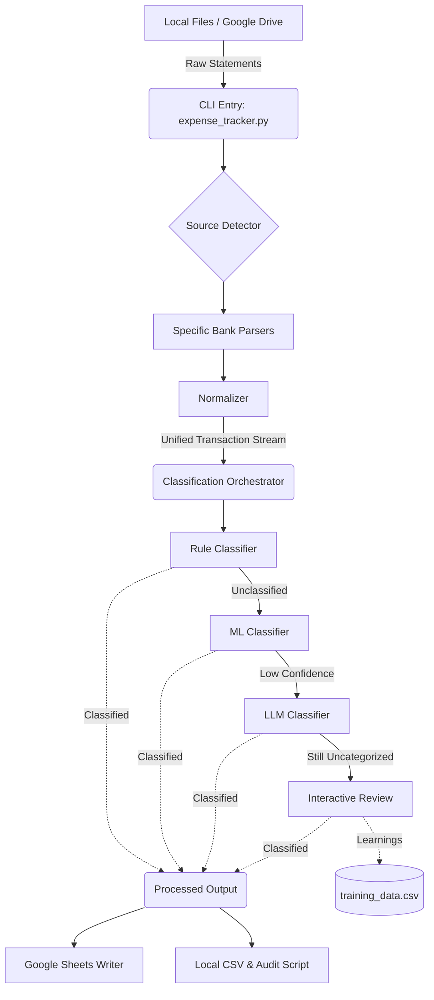

# System Architecture: Automated Expense Tracker

## 1. High-Level Architecture Overview
The Automated Expense Tracker is designed as a modular pipeline architecture. Data flows unidirectionally from raw input files (PDF/CSV) through a series of processing modules (Parsing -> Normalization -> Classification -> Export/Audit).

## 2. Core Components

### 2.1. CLI & Orchestration (`expense_tracker.py`)
- Acts as the main entry point.
- Parses command-line arguments (`--files`, `--drive-sync`, `--dry-run`, etc.).
- Initializes configuration (`config.yaml`), UI components (Rich Console), and orchestrates the pipeline flow.

### 2.2. Ingestion & Pre-processing
- **DriveFetcher (`pipeline/drive_fetcher.py`):** Connects to Google Drive using a Service Account to download un-processed statements and marks them as processed to prevent duplicates.
- **Source Detector (`utils/detector.py`):** Analyzes the file headers or content to automatically route the file to the appropriate parser.
- **Parsers (`parsers/`):** A collection of classes (e.g., `ICICISavingsParser`, `HDFCPixelParser`) that handle the idiosyncratic extraction logic for specific bank PDFs or CSVs, applying provided passwords if necessary.
- **Normalizer (`pipeline/normalizer.py`):** Standardizes the diverse dictionary outputs from parsers into a strict, unified transaction schema.

### 2.3. Classification Engine (`pipeline/classification_orchestrator.py`)
This is the brain of the tracker, employing a cascade strategy to balance speed, cost, and accuracy:
1. **Rule Classifier (`rule_classifier.py`):** Uses regex and keyword mapping defined in `config.yaml`. (Fastest, deterministic).
2. **ML Classifier (`ml_classifier.py`):** Uses traditional machine learning (e.g., Scikit-Learn based text classification) trained on `models/training_data.csv`. (Fast, probabilistic).
3. **LLM Classifier (`llm_classifier.py`):** Calls external generative AI APIs (Gemini, Nvidia) in batches. Implements caching (`.cache/llm_responses`) to save API costs. (Slowest, handles novel edge cases).
4. **Interactive Manual Review:** Prompts the user in the CLI for uncategorized or low-confidence predictions. Corrected data is appended back to the ML training data for continuous learning.

### 2.4. Export & Audit
- **Google Sheets Writer (`output/gsheets_writer.py`):** Connects to the target Google Sheet via Service Account and appends the processed data. Supports a reset mechanism.
- **Audit Script (`scripts/audit_output.py`):** Generates a comprehensive Markdown report checking for data anomalies (e.g., missing descriptions, 0.0 amounts) to ensure pipeline integrity.

## 3. Data Schema (Unified Transaction)
Once normalized, every transaction adheres to this basic schema before entering the classification pipeline:
- `transaction_date`: (YYYY-MM-DD)
- `description`: Cleaned string of the transaction narrative.
- `amount`: Float value of the transaction.
- `transaction_type`: `credit` or `debit`.
- `source_account`: Identifier of the originating account/card.
- `category`: Populated by the classifier.
- `confidence`: Float (0.0 to 1.0) indicating classifier certainty.
- `classification_method`: `rule`, `ml`, `llm`, or `manual`.

## 4. Configuration Management
- **`config.yaml`:** Stores API keys (or references them), Sheet IDs, ML thresholds, and custom rule keywords.
- **`passwords.txt` / Environment Variables:** Stores statement passwords securely so they aren't hardcoded in the codebase.
- **`credentials/service_account.json`:** GCP Service Account keys for Drive and Sheets API access.
