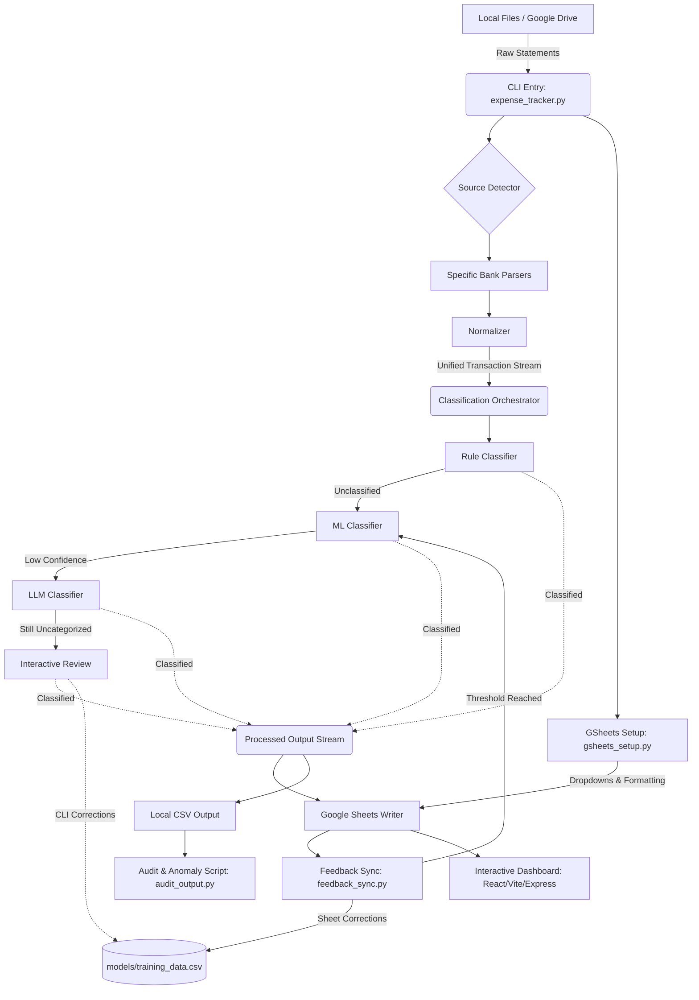

# System Architecture: Automated Expense Tracker

> **Version:** v1.1 (Baseline & Extensions)  
> **Status:** Approved / Active Implementation  

---

## 1. High-Level Architecture Overview
The **Automated Expense Tracker** is designed as an extensible, modular pipeline architecture. Data flows unidirectionally from raw ingestion sources (PDF/CSV files locally or in Google Drive) through automated extraction, normalization, multi-tiered AI classification, and final synchronization to Google Sheets and an Interactive Analytics Dashboard.

---

## 2. Core Components

### 2.1. CLI & Pipeline Orchestration (`expense_tracker.py`)
- Acts as the primary application entry point and command dispatcher.
- Parses runtime arguments:
  - Ingestion: `--files <path>`, `--drive-sync`, `--source <type|auto>`, `--passwords <list>`
  - Execution Modes: `--dry-run`, `--interactive`
  - v1.1 Extensions: `--sync-feedback`, `--retrain`, `--setup-sheet`, `--reset-sheet`
- Initializes global configuration (`config.yaml`), terminal UI styling (Rich Console), and coordinates data handoffs across modules.

### 2.2. Ingestion & Pre-processing
- **DriveFetcher (`pipeline/drive_fetcher.py`):** Authenticates via Google Service Account to fetch unprocessed bank statement files from designated Google Drive folders, tracking file IDs to prevent duplicate ingestion.
- **Source Detector (`utils/detector.py`):** Evaluates raw file headers, text content, and structural markers to route incoming statements to the appropriate institutional parser.
- **Institutional Parsers (`parsers/`):** Dedicated parser implementations (`ICICISavingsParser`, `ICICICCParser`, `AxisMyZoneParser`, `SBICashbackParser`, `HDFCPixelParser`) that decrypt PDFs using provided secrets and extract raw fields (date, description, amount, transaction type).
- **Normalizer (`pipeline/normalizer.py`):** Sanitize raw parser dictionaries into a strict unified schema—standardizing dates (`YYYY-MM-DD`), cleansing hex encoding artifacts, and formatting monetary floats.

### 2.3. Classification Engine (`pipeline/classification_orchestrator.py`)
Employs a cascade strategy designed to optimize processing speed, API costs, and categorization accuracy:
1. **Rule Classifier (`rule_classifier.py`):** Evaluates regex and keyword patterns defined in `config.yaml`. (Deterministic, instantaneous latency).
2. **ML Classifier (`ml_classifier.py`):** Uses Scikit-Learn TF-IDF vectorization and classification trained on `models/training_data.csv`. (Probabilistic, sub-second latency).
3. **LLM Classifier (`llm_classifier.py`):** Invokes external generative AI APIs (Google Gemini / Nvidia) in optimized batches. Caches responses in `.cache/llm_responses` to eliminate repeated API costs for identical descriptions.
4. **Interactive Manual Review:** Prompts users via CLI (`--interactive`) for ambiguous or low-confidence transactions.
5. **Feedback Sync & Auto-Retrain (`pipeline/feedback_sync.py`):** The v1.1 continuous learning loop. Reads human-reviewed rows (`review_status = 'corrected'`) from live Google Sheets, appends new examples to `training_data.csv`, updates sheet status to `'synced'`, and automatically triggers `MLClassifier.train()` whenever newly synced rows equal or exceed `retrain_trigger_count` (default: 10).

### 2.4. Export, Audit & Sheet Management
- **Google Sheets Writer (`output/gsheets_writer.py`):** Appends processed transactions to target spreadsheets via Google Sheets API. Supports `--dry-run` (intercepting network calls for safe verification) and `--reset-sheet`.
- **Google Sheets Setup (`output/gsheets_setup.py`):** Uses `gspread-formatting` to inject data validation dropdown menus on category columns, format headers, and establish visual formatting rules (`--setup-sheet`).
- **Anomaly Auditor (`scripts/audit_output.py`):** Scans processed records for data corruption or missing fields. Integrates an optional fields whitelist (`audit_optional_fields` in `config.yaml`) so review metadata (`reviewed_category`, `reviewed_at`, `reviewer_notes`) is legitimately ignored when blank, while core anomalies (0.0 amounts, missing descriptions) are flagged.
- **Duplicate Tracking:** Flagged duplicate transactions (`is_duplicate = True`) are preserved in output records for audit transparency rather than silently deleted.

### 2.5. Interactive Expense Dashboard (`dashboard/`)
A self-contained, zero-cost web analytics application providing rich financial visualization:
- **Backend Server (`server.js`):** Lightweight Node.js/Express application serving static frontend assets and exposing JSON endpoints (`/api/data.json`) fed directly by pipeline exports or Sheets data.
- **Frontend Architecture (`src/`):** Built with React 18, Vite, and Vanilla CSS/Tailwind CSS for maximum responsiveness and aesthetics.
- **Data Layer (`src/utils/dataLayer.ts`):** 
  - Dynamic Resolution: Resolves raw transaction categories against live Sheet mapping tabs (`Category_Map` and `Merchant_Aliases`), computing `effective_category` and `effective_bucket` (Needs, Wants, Savings, Investments).
  - Stale Bucket Override: Dynamically overrides historical buckets when category mapping rules are updated in the sheet.
  - Exclusions & Cleanliness: Automatically filters out inter-account transfers from total expenditure/income metrics and cleanly truncates descriptions to ~60 characters.
- **Five Reactive Views:** Overview (KPIs and monthly trends), Categories (interactive spend charts), Banks & Accounts (utilization tracking), Classification Health (AI confidence & method breakdown), and Audit & Anomalies (duplicate and review queues).

### 2.6. Developer Utility Suite (`scripts/`)
A modular suite of 11 CLI developer tools for debugging, data manipulation, and quality assurance:
- `audit_output.py`: Post-pipeline anomaly and schema integrity auditor.
- `audit_transactions.py`: Standalone transaction validation tool.
- `check_sheet_cats.py`: Verifies GSheets category dropdown alignment against `config.yaml`.
- `cleanup_transactions.py`: Sanitizes and deduplicates raw historical datasets.
- `export_for_labeling.py`: Exports unverified records formatted for rapid human labeling.
- `export_for_llm.py`: Formats transaction batches for LLM prompt evaluation and benchmarking.
- `hex_exposer.py`: Inspects PDF binary character encodings and hidden hex strings.
- `nuke_csv.py`: Cleans local output directories and test CSV outputs.
- `pull_training_data.py`: Fetches and validates external training sets from sheet backups.
- `test_crypto_core.py`: Standalone verification of PDF password decryption routines.
- `dev-tools/terminal_peek.py`: Inspects live terminal formatting and ANSI sequences.

---

## 3. Data Schema (Unified Transaction)
Once normalized, every transaction adheres to a strict schema throughout classification, export, and analytics ingestion:
- `transaction_date`: String in `YYYY-MM-DD` format.
- `description`: Cleaned narrative text of the transaction.
- `amount`: Float value representing monetary volume.
- `transaction_type`: `credit` (income/refund) or `debit` (expense/payment).
- `source_account`: Identifier of the originating institutional account or credit card.
- `category`: Assigned expense category (e.g., Food, Shopping, Bills, Transfer).
- `confidence`: Float (0.0 to 1.0) indicating AI classification certainty.
- `classification_method`: String indicating originating tier (`rule`, `ml`, `llm`, or `manual`).
- `review_status`: Review workflow state (`pending`, `reviewed`, `corrected`, or `synced`).
- `reviewed_category`: Human-corrected category string (if applicable).
- `reviewed_at`: ISO timestamp of human review.
- `reviewer_notes`: Optional free-form reviewer annotations.
- `is_duplicate`: Boolean flag indicating whether the transaction is a retained duplicate.
- `effective_category` & `effective_bucket`: Dynamically resolved fields computed in the dashboard data layer.

---

## 4. Configuration & Secrets Management
- **`config.yaml`:** Configures classification rules, ML confidence thresholds, LLM parameters, target Google Sheet IDs, `retrain_trigger_count` (default: 10), and `audit_optional_fields` whitelist.
- **`passwords.txt` / `PDF_PASSWORDS`:** Stores PDF decryption keys locally or via environment variables without committing secrets to version control.
- **`credentials/service_account.json`:** GCP Service Account credentials for automated Google Drive and Google Sheets API authentication.
- **`dashboard/.env`:** Configures frontend server endpoints and local data source paths for the interactive dashboard.
