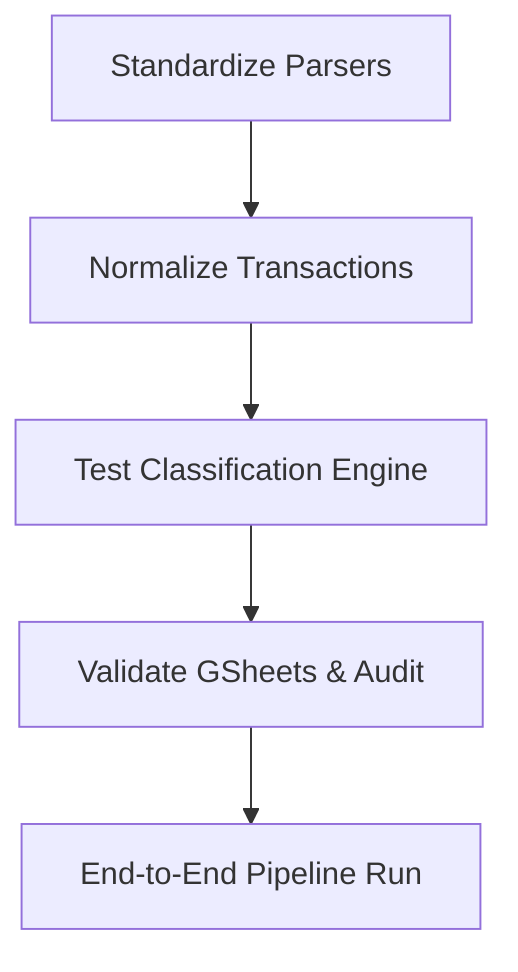

# 05A_TASKS.md — 执行主清单 (Automated Expense Tracker)

> 版本: v1
> 产出自: /blueprint
> 验证计划: 05B_VERIFICATION_PLAN.md

## 依赖图总览

## Sprint 路线图

| Sprint | 代号 | 核心任务 | 退出标准 | 预估 |
|--------|------|---------|---------|------|
| S1 | Core Testing | Add unit & integration tests for all existing modules | 100% pass on all existing parsers and pipeline modules | 2d |
| S2 | Hardening | Enforce strict typing & security (passwords) rules | No lint errors, secure secrets handling | 2d |

---

## System 1: Expense Tracker Validation & Hardening

### Phase 1: Ingestion & Normalization

- [x] **T1.1.1** [REQ-PARSE]: Standardize Bank Parsers
  - **描述**: Refactor and add strict unit tests for all PDF/CSV parsers (ICICI, Axis, SBI, HDFC) to enforce consistent extraction and missing-value handling.
  - **输入**: `.anws/prd.md §4.2`, `.anws/system_architecture.md §2.2`
  - **输出**: `tests/unit/test_parsers.py`, modifications in `parsers/*.py`
  - **契约承接**: Raw extraction contract
  - **验收标准**:
    - Given a mocked valid PDF/CSV statement for each bank
    - When parsed
    - Then the output contains exactly the expected fields (date, description, amount, type) with no unhandled exceptions
  - **验证类型**: 单元测试
  - **E2E触发设想**: N/A
  - **验证摘要**: Test all parser edge cases locally without passwords.
  - **验证引用**: `05B_VERIFICATION_PLAN.md#t1-1-1`
  - **证据产出**: `tests/unit/test_parsers.py`
  - **估时**: 4h
  - **依赖**: 无
  - **优先级**: P0

- [x] **T1.1.2** [REQ-NORM]: Transaction Normalization Rules
  - **描述**: Enforce standard data types and rules in `Normalizer`.
  - **输入**: `.anws/prd.md §4.2`
  - **输出**: `tests/unit/test_normalizer.py`, modifications in `pipeline/normalizer.py`
  - **契约承接**: Unified transaction format contract
  - **验收标准**:
    - Given messy raw data from parsers
    - When normalized
    - Then dates are standardized (YYYY-MM-DD), descriptions are stripped of special chars, amounts are floats.
  - **验证类型**: 单元测试
  - **验证摘要**: Ensure unified schema integrity.
  - **验证引用**: `05B_VERIFICATION_PLAN.md#t1-1-2`
  - **证据产出**: `tests/unit/test_normalizer.py`
  - **估时**: 2h
  - **依赖**: T1.1.1
  - **优先级**: P0

### Phase 2: Classification Engine

- [x] **T1.2.1** [REQ-CLASS]: Test Classification Orchestration
  - **描述**: Add unit tests for Rule, ML, and LLM classifiers, explicitly testing the fallback mechanism (Rule -> ML -> LLM).
  - **输入**: `.anws/system_architecture.md §2.3`
  - **输出**: `tests/unit/test_classifiers.py`, modifications in `pipeline/classification_orchestrator.py`
  - **契约承接**: Cascade classification contract
  - **验收标准**:
    - Given a transaction matching a rule, ensure it halts at Rule Classifier.
    - Given an unknown transaction, ensure it cascades to ML and then LLM (mocked).
  - **验证类型**: 单元测试 / 集成测试
  - **验证摘要**: Verify pipeline branching logic and cache hits.
  - **验证引用**: `05B_VERIFICATION_PLAN.md#t1-2-1`
  - **证据产出**: `tests/unit/test_classifiers.py`
  - **估时**: 4h
  - **依赖**: T1.1.2
  - **优先级**: P0

### Phase 3: Export & Audit

- [x] **T1.3.1** [REQ-OUT]: Validate GSheets & CLI Dry-Run
  - **描述**: Add integration tests for Google Sheets writer avoiding real API calls during dry-run, and test the Audit report generator.
  - **输入**: `.anws/prd.md §4.4`
  - **输出**: `tests/integration/test_gsheets.py`, `tests/unit/test_audit.py`
  - **契约承接**: Export formatting contract
  - **验收标准**:
    - Given the `--dry-run` flag
    - When the writer is called
    - Then no API calls are made to Google Sheets, but local CSV is fully generated.
  - **验证类型**: 集成测试
  - **验证摘要**: Safety checks on Google Sheets sync and audit warnings.
  - **验证引用**: `05B_VERIFICATION_PLAN.md#t1-3-1`
  - **证据产出**: `tests/integration/test_gsheets.py`
  - **估时**: 3h
  - **依赖**: T1.2.1
  - **优先级**: P1

---

## INT 集成验证任务

- [x] **INT-S1** [MILESTONE]: S1 集成验证 — End-to-End Pipeline
  - **描述**: Validate the entire CLI command flow locally.
  - **输入**: All previous tasks.
  - **输出**: E2E test report.
  - **验收标准**:
    - Given test statements in a local directory
    - When `expense_tracker.py --files tests/data/sample.csv --dry-run --source auto` is executed
    - Then pipeline completes with exit code 0, and `output/transactions.csv` has expected rows.
  - **验证类型**: E2E测试
  - **验证说明**: Mock the LLM API to prevent cost; verify console output and CSV structural integrity.
  - **依赖**: T1.3.1

---

## v1.1 Post-v1 Pipeline Extensions (Scope-Creep Tracking)

- [x] **T1.4.1** [REQ-FEEDBACK]: Continuous Learning Feedback Sync
  - **描述**: Create `pipeline/feedback_sync.py` to read corrected manual categorizations back from Google Sheets into ML training data, supporting `--sync-feedback` and automatic retraining trigger.
  - **输入**: Google Sheets manual review columns (`review_status`, `reviewed_category`).
  - **输出**: `pipeline/feedback_sync.py`, `models/training_data.csv`, `tests/unit/test_feedback_sync.py`.
  - **验收标准**:
    - Given rows in GSheets where `review_status = 'corrected'`, appends new training examples and updates status to `'synced'`.
  - **优先级**: P1

- [x] **T1.4.2** [REQ-SETUP]: Google Sheets Formatting & Validation Setup
  - **描述**: Create `output/gsheets_setup.py` using `gspread-formatting` to inject Data Validation dropdowns and Conditional Formatting via `--setup-sheet`.
  - **输入**: `.anws/prd.md` manual review workflow.
  - **输出**: `output/gsheets_setup.py`.
  - **验收标准**:
    - Given `--setup-sheet`, applies dropdowns and styling without modifying existing transaction records.
  - **优先级**: P1

- [x] **T1.4.3** [REQ-RETRAIN]: Standalone & Triggered ML Retraining
  - **描述**: Support `--retrain` flag and automatic trigger threshold in `expense_tracker.py` to rebuild ML embedding cache.
  - **输入**: `config.yaml` (`retrain_trigger_count`).
  - **输出**: `expense_tracker.py` CLI integration.
  - **验收标准**:
    - Given `--retrain` or threshold reached during sync, invokes `MLClassifier` cache rebuild.
  - **优先级**: P1

- [x] **T1.4.4** [REQ-UTILS]: Auxiliary Development & Utility Scripts
  - **描述**: Maintain and document auxiliary data manipulation, auditing, and debugging scripts under `scripts/`.
  - **输出**:
    - `scripts/audit_output.py`: Post-pipeline anomaly and integrity auditor.
    - `scripts/audit_transactions.py`: Standalone transaction verification script.
    - `scripts/check_sheet_cats.py`: Category validation utility for Google Sheets.
    - `scripts/cleanup_transactions.py`: Data normalization and sanitization helper.
    - `scripts/export_for_labeling.py`: Exports raw records for manual ML training dataset labeling.
    - `scripts/export_for_llm.py`: Prepares transaction batches for LLM prompt evaluation.
    - `scripts/hex_exposer.py`: Debug utility to inspect hex character encodings in raw PDFs.
    - `scripts/nuke_csv.py`: Quick utility to reset local CSV outputs.
    - `scripts/pull_training_data.py`: Fetches training records from external sources.
    - `scripts/test_crypto_core.py`: Standalone cryptography/decryption tester.
    - `scripts/dev-tools/terminal_peek.py`: CLI terminal inspection utility.
  - **优先级**: P2

- [x] **DASH-v1.1** [REQ-DASHBOARD]: Interactive Expense Dashboard
  - **描述**: Implement an interactive analytics dashboard (read-only) with strict data resolution rules, 5 reactive views, and zero recurring cost.
  - **输入**: `PRD_Interactive_Expense_Dashboard.md`, `Transactions`, `Category_Map`, and `Merchant_Aliases` tabs in Google Sheets.
  - **输出**: Dashboard data layer (`dashboard/src/utils/dataLayer.ts` or equivalent API layer), frontend views, and comprehensive unit tests.
  - **验收标准**:
    - Given transactions with corrections, effective_category and effective_bucket are resolved dynamically against Category_Map.
    - Transfer rows are excluded from spend/income/investment totals.
    - Descriptions are truncated to ~60 characters.
    - 5 reactive views (Overview, Categories, Banks, Classification Health, Audit/Anomalies) filter live without reload.
  - **优先级**: P1

- [x] **DASH-ARCH-P1** [REQ-REF-P1]: Phased Architectural Refactor (Phase 1 — High Priority)
  - **描述**: Split dashboard into multiple feature views with lazy loading, fix custom date from/to filtering, add top-right settings dropdown with developer toggle, move aggregation to Node.js backend, version REST endpoints (`/api/v1/...`), enable Brotli/Gzip compression, and virtualize transaction tables.
  - **输入**: User architectural proposal & feedback.
  - **输出**: Modular server routes, virtualized table components, and fixed date filtering.
  - **验收标准**:
    - Given custom Date From and Date To filter selections, transactions and KPIs filter accurately against `transaction_date`.
    - Developer toggle resides in top-right settings dropdown and cleanly hides/reveals System Health view.
    - API responses use Brotli/Gzip compression and render via virtualized DOM tables smoothly.
  - **优先级**: P1

- [x] **DASH-ARCH-P2** [REQ-REF-P2]: Phased Architectural Refactor (Phase 2 — Medium Priority)
  - **描述**: Integrate `better-sqlite3` structured database abstraction, `@tanstack/react-query` server state management, feature-based project folder reorganization, backend in-memory TTL caching, and runtime Zod payload validation.
  - **输入**: Phase 1 deliverables.
  - **输出**: `StorageRepository` SQLite implementation, `apiClient.ts` with Zod schemas, feature-based structure under `src/features/*`.
  - **验收标准**:
    - Given backend queries, SQLite executes local aggregations with sub-millisecond response times.
    - Frontend queries leverage React Query caching and Zod schema validation.
  - **优先级**: P2

- [x] **DASH-ARCH-OPT** [REQ-REF-OPT]: Observability & Regression Testing
  - **描述**: Implement browser Performance API timing instrumentation and comprehensive automated tests.
  - **输出**: `observability.ts`, API endpoint regression tests, QA verification check passes.
  - **验收标准**:
    - All existing Python tests (`pytest`), TypeScript QA checks (`npm run test:qa`), and API regression tests pass 100%.
  - **优先级**: P2

